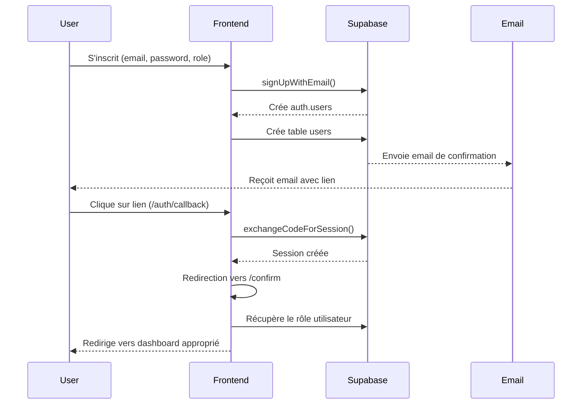

# Système d'Authentification avec Supabase

Ce document explique le fonctionnement du système d'authentification de l'application AgentMarket.

## Architecture

Notre système d'authentification repose sur Supabase Auth et utilise les composants suivants :

1. **Tables Supabase** :
   - `auth.users` : Table gérée par Supabase contenant les informations d'authentification
   - `users` : Notre table personnalisée liée directement à `auth.users` via l'ID, contenant les données utilisateur

2. **Flux d'Inscription** :
   - L'utilisateur s'inscrit via `/signup`
   - Les métadonnées incluent le rôle choisi (creator/enterprise)
   - Une entrée est créée dans `auth.users` puis dans `users`
   - Un email de confirmation est envoyé

3. **Confirmation Email** :
   - Le lien de confirmation dirige vers `https://marketplaceagentai.vercel.app/auth/callback`
   - Le callback échange le code contre une session
   - Redirection vers `/confirm` où le rôle est vérifié
   - Redirection automatique vers le dashboard approprié

4. **Connexion** :
   - L'utilisateur se connecte via `/signin`
   - Le système vérifie si l'email est confirmé
   - Le rôle est récupéré depuis la table `users`
   - Redirection vers le dashboard approprié en fonction du rôle

5. **Protection des routes** :
   - Middleware pour protéger les routes du dashboard
   - Composant `RoleBasedRedirect` pour la redirection basée sur le rôle
   - Règles RLS dans Supabase pour sécuriser les données

## Flux d'Authentification

## Règles de Sécurité (RLS)

Des règles RLS (Row Level Security) sont appliquées sur les tables `users` et `favorites` pour garantir que :

1. Les utilisateurs ne peuvent voir/modifier que leurs propres données
2. Certaines données de base sont disponibles en lecture (nom, rôle) pour l'affichage
3. Les insertions ne sont autorisées que pour l'utilisateur concerné

## Middleware et Redirection

Le middleware gère :
- Protection des routes du dashboard pour les utilisateurs non authentifiés
- Redirection des utilisateurs authentifiés depuis les pages d'auth

Le composant `RoleBasedRedirect` :
- Détecte la session active
- Récupère le rôle depuis la table `users`
- Redirige vers le dashboard approprié

## Environnement de Production

En production, les paramètres suivants sont essentiels :
- URL de redirection configurée dans Supabase : `https://marketplaceagentai.vercel.app/auth/callback`
- Configuration correcte des emails dans Supabase
- Variables d'environnement complètes dans Vercel

## Dépannage

Si un utilisateur ne peut pas se connecter :
1. Vérifier si l'email est confirmé dans Supabase
2. Vérifier si l'entrée existe dans la table `users`
3. Vérifier les droits RLS
4. Vérifier les logs d'erreur dans la console
